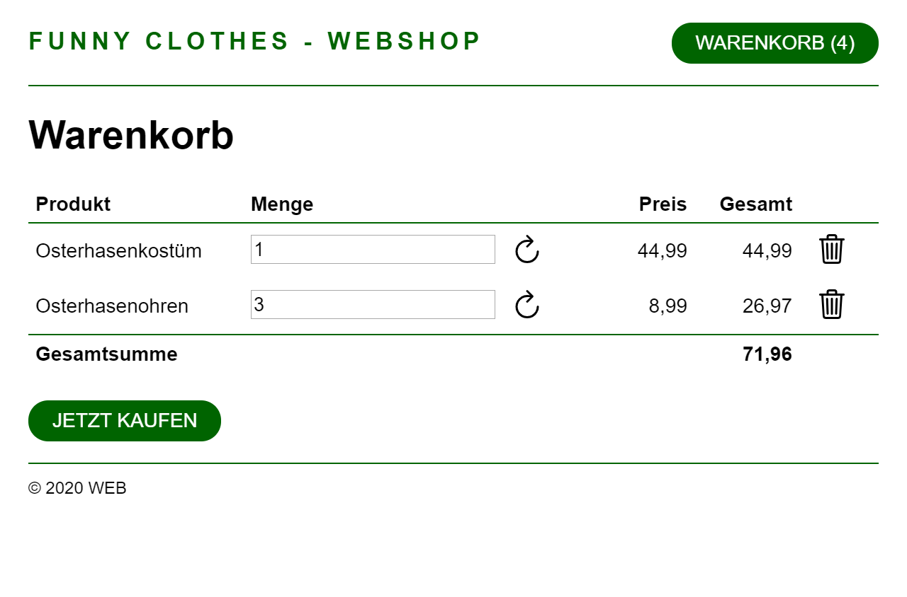
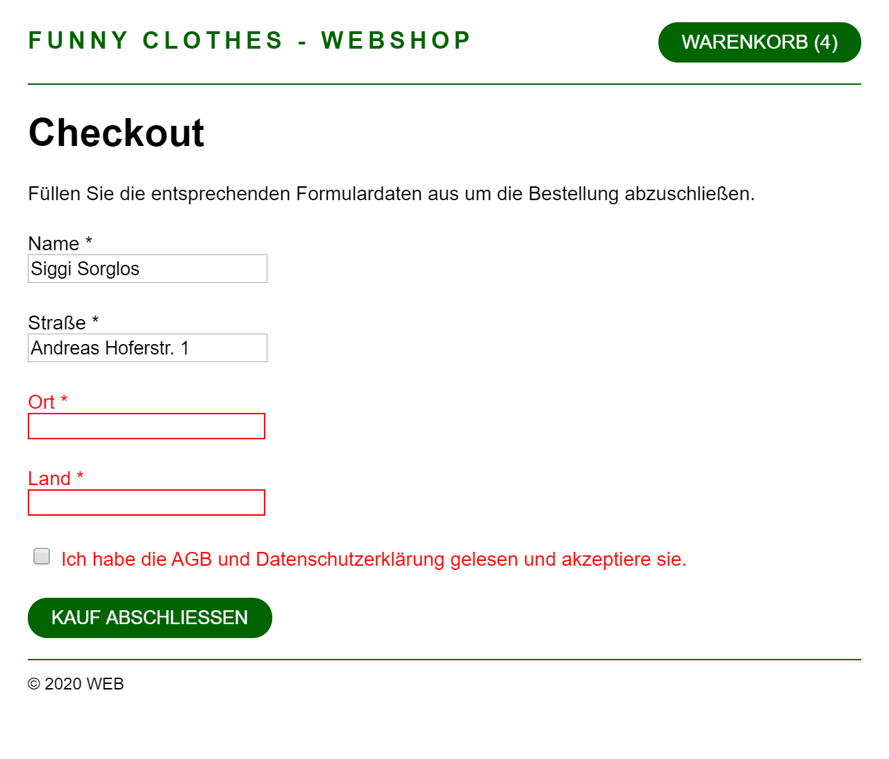

# Übungblatt 2

In diesem Übungsblatt soll eine einfache Shopping-Cart Web-Applikation erstellt werden. Das Grundgerüst der Applikation ist nach einer einfachen klassischen Web-Architektur aufgebaut.

Schauen Sie sich im ersten Schritt die einzelnen Bestandteile der Applikation an und versuchen Sie die unterschiedlichen Komponenten und Funktionsweisen der Architektur zu verstehen.

Die Ordnerstruktur ist nach dem verbreiteten [pds/skeleton](https://github.com/php-pds/skeleton) Layout für php Anwendungen aufgebaut. Eine ähnliche Ordnerstruktur wird auch vom Laravel Framework verwendet.

## Start

 - Erstellen Sie einen Fork des Projektes
 - `git clone` Ihres Fork auf Ihren lokalen Rechner
 - Datenbank und Datenbank Inhalte werden durch ausführen des Skriptes erzeugt: `php bin/setup.php`
 - Die Fehlerausgabe finden Sie im Log des Web-Servers
 - Starten Sie einen lokalen Web-Server im Hauptverzeichnis des Projektes mit `php -S localhost:9000 -t ./public ./config/local_routing.php`
 - Zur Abgabe erzeugen Sie einen `Merge Request` zum originalen Repository, der Zeitstempel des `Merge Request` ist wichtig, da dieser als Abgabezeitpunkt zählt
 
## Übung 0

Auf der Startseite sollen alle Artikel des kleinen Web-Shops dargestellt werden. Dazu ist folgendes zu bearbeiten:

 - Die Methode `getAllProducts` der Klasse `Product` ist zu implementieren. Diese Methode soll alle Artikel aus der Datenbank zurückgeben. 
 - Die Artikel, welche über die Klasse `Product` abgefragt werden, sollen entsprechend dem HTML-Snippet auf der Startseite ausgegeben werden. Die Startseite ist unter `src/actions/get/home.php` zu finden. Innerhalb der PHP-Schleife über die Produkte soll das Snippet entsprechend eingefügt werden. Die Platzhalter `[PHP Ausgabe: ...]` sollen durch ensprechenden PHP-Code ersetzt werden.

```html
<section id="product-[PHP Ausgabe: $idx + 1]">
    
    <div>
        <h2>[PHP Ausgabe: Artikelname]</h2>
        <p>[PHP Ausgabe: Artikelbeschreibung]</p>
        <span>[PHP Ausgabe: Preis]</span>
        <form method="post" action="/cart">
            <input name="add_product" type="hidden" value="[PHP Ausgabe: Produkt ID]">
            <button type="submit">Zum Warenkorb hinzufügen</button>
        </form>
    </div>
</section>
```

---
**Hinweis:**
*Alle Beträge (Preis) sollen mit der PHP-Funktion `number_format` formatiert werden. Zahlen sollen folgendermaßen formatiert sein #.###,## (2 Dezimalstellen, `,` als Separator für die Dezimalstellen und `.` als Separator für die Tausender)*


## Übung 1: Warenkorb füllen (2h)

Auf der Startseite befinden sich die Produkte, welche im Funny Clothes Webshop angeboten werden. Diese Produkte sollen jeweils über den Button `Zum Warenkorb hinzufügen` in den Warenkorb gelegt werden können.

Implementieren Sie dazu die Methoden `countProducts` und `addProduct($productId)` der Klasse `Cart`. Der Inhalt des Warenkorbs soll innerhalb der `$_SESSION` Superglobal gespeichert sein.

Innerhalb der Datei `src/actions/post/cart.php` soll die `addProducts` Methode entsprechend aufgerufen werden, sodass der Artikel im Warenkorb hinzugefügt wird.

## Übung 2: Warenkorb ansehen (2h)

Mit Klick auf den Warenkorb-Button rechts oben, kommt man zur Ansicht des Warenkorbes. Auf der Warenkorb-Seite sollen alle Artikel inkl. Menge, Preis und Gesamtsumme dargestellt werden. Ebenfalls soll die Gesamtsumme über den gesamten Inhalt des Warenkorbs ermittelt und dargestellt werden. 

Es sollen die Funktionen `getProducts` und `getTotal` der Klasse `Cart` implementiert werden.

Der Warenkorb wird als Tabelle dargstellt. Dabei soll für jeden Artikel der im Warenkorb liegt eine Tabellenzeile mit folgender Struktur erzeugt werden. Dabei sollen alle Stellen mit `[PHP Ausgabe: ...]` entsprechende durch eine PHP Ausgabe erstetzt werden:

```html
<tr>
    <td>
        [PHP Ausgabe: Produktname]
    </td>
    <td>
        <form action="/cart" method="post">
            <input type="hidden" name="update_product" value="[PHP Ausgabe: Produkt ID]">
            <input type="number" name="quantity" value="[PHP Ausgabe: Menge aus dem Warenkorb]">
            <button type="submit">
                
            </button>
        </form>
    </td>
    <td class="right">
        [PHP Ausgabe: Produkteinzelpreis]        
    </td>
    <td class="right">
        [PHP Ausgabe: Gesamtpreis Zeile (Menge * Preis)]
    </td>
    <td>
        <form action="/cart" method="post">
            <input type="hidden" name="remove_product" value="[PHP Ausgabe: Produkt ID]">
            <button type="submit">
                
            </button>
        </form>
    </td>
</tr>
```

---
**Hinweis:**
*Alle Beträge sollen entsprechend zu Übung 0 mit `number_format` formatiert werden.*

## Übung 3: Warenkorb editieren (2h)

Im Warenkorb befinden sich zu jeder Artikelzeile zwei Aktionen. Es soll die Möglichkeit geben die Menge zu ändern und es soll die Möglichkeit geben den Artikel aus dem Warenkorb zu entfernen.

Dazu soll die Methode `updateProduct` der Klasse `Cart` implementiert werden. Falls diese Methode eine `$quantity <= 0` bekommt, soll der Artikel aus dem Warenkorb entfernt werden.

Des Weiteren sollen die beiden Actions `Remove Product` und `Update Product` in der Datei `src/actions/post/cart.php` implementiert werden.

## Übung 4: Checkout Formular (2h)

Innerhalb eines gefüllten Warenkorbes findet sich der Button `JETZT KAUFEN`. Mit Klick auf den Button kommt man zum Checkout. Dort findet sich ein Formular mit wichtigen Daten für den Bestellabschluss. 

Dieses Formular soll vollständig ausgefüllt werden um die Bestellung abzuschließen und alle Formularfelder sind Pflichtfelder.

Falls das Formular nicht vollständig ausgefüllt wurde, soll das Formular neu geladen werden. In der Datei `src/actions/post/checkout.php` soll geprüft werden, ob die Formularfelder entsprechend ausgefüllt wurden. Bei fehlenden Inhalten, soll die Variable `$_SESSION['flash']` mit `'error'` Felder angeben die nicht ausgefüllt wurden und mit `'old'` Felder und Feldinhalte angeben die korrekt ausgefüllt wurden.

Folgendes Beispiel zeigt das Resultat eines Formulars, dass teilweise ausgefüllt wurde. `street`, `country` und `confirmation` wurden ausgefüllt, die Felder `name` und `place` wurden leer gelassen:

```php
<?php
$_SESSION["flash"] = [
    "old" => [
        "street" => "Meine Straße 25",
        "country" => "Deutschland",
        "confirmation" => "on"
    ],
    "error" => [
        "name" => true,
        "place" => true
    ]
];
```

Bei einem unvollständig ausgefüllten Formular wird ein Redirect zum Checkout Formular durchgeführt und dieses wird entsprechend der `$_SESSION['flash']` Inhalte angezeigt.

## Übung 5: Checkout durchführen (2h)

Falls das Bestellformular erfolgreich eingereicht wurde, soll die Bestellung entsprechend durchgeführt werden.

Einerseits soll dazu die Methode `addOrder` der Klasse `Order` implementiert werden. Diese Methode soll die Daten aus dem Formular und aus dem Warenkorb übernehmen und daraus die Bestellung in die Datenbank abspeichern. Die Bestellung soll in den Tabellen `orders` und `order_items` entsprechend hinterlegt werden.

Andererseits muss nachdem die Bestellung in die Datenbank abgelegt wurde der Warenkorb geleert werden. Dazu soll die Methode `clearCart` der Klasse `Cart` implementiert werden.

In der Datei `src/actions/post/checkout.php` sollen die Methoden entsprechend ausgeführt werden.

## Screenshots

### Startseite


### Warenkorb



### Bestellformular



## Kontrolle & Test

Für alle Übungen sind Testfälle definiert. Um die automatisierten Tests durchzuführen müssen alle verwendeten Bibliotheken geladen werden:

```bash
composer install
```

Parallel zu den Testläufen muss ein Web-Server gestartet werden, am einfachsten in einer eigenen Kommandozeile:

```bash
composer run start
```

Mit folgenden Kommandos können die Tests ausgeführt werden:

```bash
composer run test-ue0
composer run test-ue1
composer run test-ue2
composer run test-ue3
composer run test-ue4
composer run test-all
```
# PHP-Wiederholung

